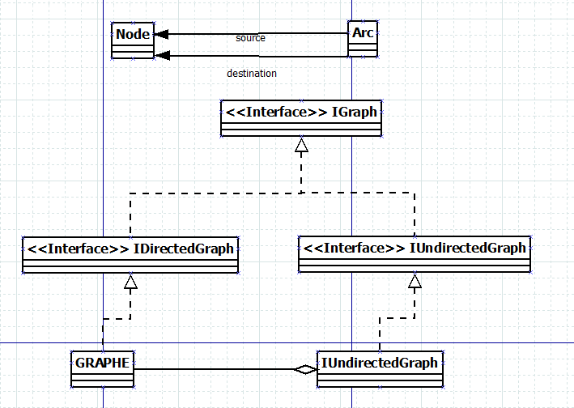
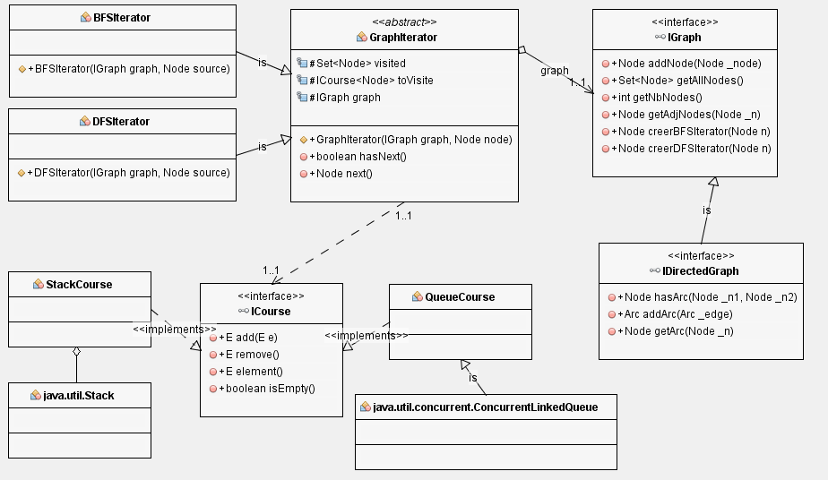

**Bertrand/Axel**

**Bontron/Julien**

# Rapport TP1

## Question 1
fonction getAllNodes():
On recupère toutes les clés de la map grâce à la fonction KeySet().

fonction getNbNodes():
On récupère la taille de la map afin de connaitre le nombre de noeud du graphe.

fonction getAdjNodes(Node _n):
On recupère les arcs sortant du noeud passé en paramètre et on recupère tous les noeuds qui sont à destination des arcs.

fonction toString():
On crée un StringBuilder et pour chaque noeud, on l'ajoute dans la variablr avec de la ponctuation, puis on parcourt chaque arc, 
qu'on ajoute également dans la variable ainsi que la ponctuation souhaité. Une fois que nous avons parcouru tous les arcs de tous 
les noeuds on retourne la variable au format string ce qui nous donne le résultat souhaité.

## Question 2
Afin de réutiliser le maximun de code nous utilsons un Pattern Adapter comme vous pouvez l'observer sur l'image suivante

## Question 3 et 4
Afin de garder notre logique de réutilisation maximale du code nous avons déjà implémenté, en plus du pattern iterator nous avons également réutilsé le pattern 
adapter avec les classes QueueCourse adaptant une queue pour le parcours en largeur et StackCourse, adaptant un stack pour le parcours en profondeur 
qui implémentent l'interface ICourse.
Vous pouvez observer le schéma UML sur l'image suivante.

Les parcours fonctionnent correctement au vu des différents tests que nous avons effectués.  

